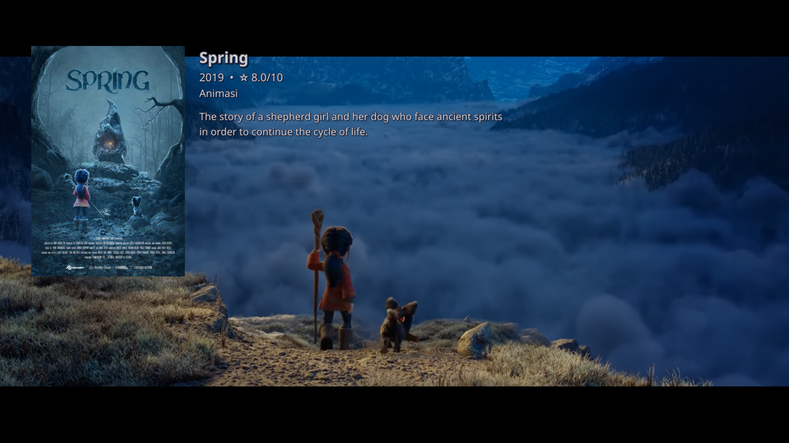

# Mirip Kodi

Mirip Kodi (Similar to Kodi) Adalah Script Mpv Yang Menampilkan Clear Logo, Genre Film atau TV Show dan Jam di Kanan Atas Layar.
Sript ini Juga dapat menampilkan Poster, Rating dan Sinopsis Singkat (Overview) Film atau TV Show Koleksi Anda,
Yang Tampilanya Mirip Dengan Kodi Media Center, ya kita tahu kalau player bawaan Kodi Media Center itu burik. 
Dengan Script ini anda akan merasakan kualitas gambar MPV yang mendukung banyak GLSL Shader dan berbagai macam filter.
Mirip Kodi Juga menyertakan Sript Python Untuk Auto Scrapping Metadada,Poster,Clear logo dll dari TMDB a.k.a https://www.themoviedb.org/

Clear Logo, Genre dan Jam akan muncul saat Mouse Bergerak dan akan menghilang dengan sendirinya default 10 detik.

Poster Rating dan Sinopsis akan muncul saat Right Clik (Klik Kanan Pada Mouse) dan akan hilang jika klik kanan lagi.

